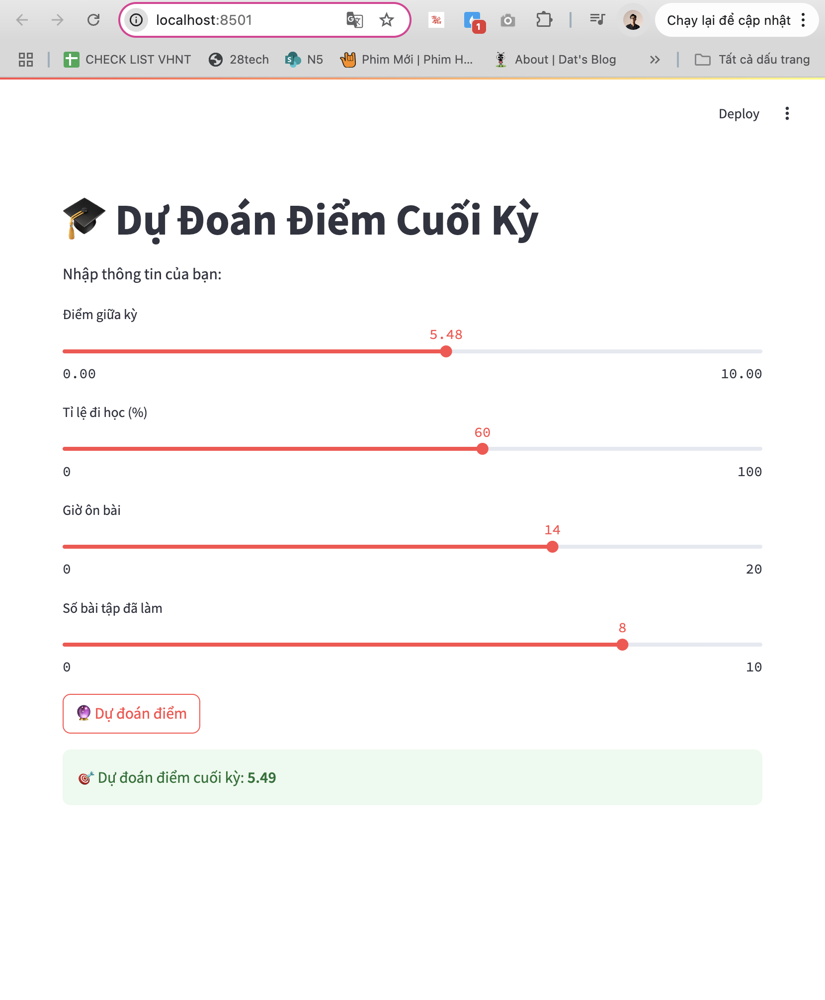

# 🎓 Score Prediction – AI Mini Project

A simple AI-powered web app that predicts a student's final exam score based on their:

- Midterm score
- Attendance percentage
- Study hours
- Number of completed assignments

## 💡 Technologies Used

- Python
- Pandas, Scikit-learn
- Streamlit (for web UI)
- Linear Regression

## 🚀 How to Run

1. Install required libraries:
   ```bash
   pip install pandas scikit-learn streamlit

2. Run the app:

    streamlit run app.py

3. Open your browser at http://localhost:8501 to use the app.
